<div align="center">



<br/>

[](https://t.me/MarkdownRenderBot)
[](./LICENSE)
[](https://workers.cloudflare.com/)
[](https://core.telegram.org/bots/api)

**فارسی** · [English](#-english) — [پرش به فارسی](#-فارسی)

</div>

<br/>

<div align="center">

<a href="https://t.me/Paradise_Of_Freedom"></a>
<a href="https://t.me/MarkdownRenderBot"></a>
<a href="https://github.com/DarknessShade/TeleRich"></a>

</div>

<br/>

---

## 🇮🇷 فارسی

### 📌 این پروژه چیست؟

**TeleRich** یک ربات و استودیوی تحت‌وب برای ساخت **پیام‌های ریچ تلگرام (Rich Message)** است که **تماماً روی Cloudflare Workers** اجرا می‌شود — بدون سرور، بدون دیتابیس، بدون هیچ زیرساخت اضافه‌ای. کافی است متن ساده به‌صورت **Markdown** یا **HTML** بفرستید تا فوراً به یک پیام ریچ و فرمت‌شده در تلگرام تبدیل شود (بر پایه‌ی [Telegram Bot API نسخه‌ی ۱۰.۳](https://core.telegram.org/bots/api#rich-message-formatting-options) که امکانات فرمت‌بندی پیشرفته‌ای مثل بلوک‌ها، دکمه‌های ریچ و پیام‌های زودگذر را اضافه کرده است).

می‌توانید ربات زنده و آماده‌ی پروژه را همین حالا امتحان کنید: **[@MarkdownRenderBot](https://t.me/MarkdownRenderBot)**

> 💡 یک نسخه‌ی پایتونی از همین ایده هم توسط جامعه ساخته شده: **[TeleRich Python (arshiaCP)](https://github.com/arshiacomplus/TeleRich)**

### ✨ ویژگی‌ها

**۱. تبدیل متن به پیام ریچ**
- ورودی هم **Markdown** و هم **HTML** پشتیبانی می‌شود؛ اگر پیامتان تگ HTML داشته باشد به‌صورت خودکار به‌عنوان HTML پردازش می‌شود.
- پشتیبانی کامل از المان‌های متنی: بولد، ایتالیک، زیرخط، خط‌خورده، اسپویلر (`||text||`)، کد تک‌خطی و بلوک کد، بلاک‌کوت و بلاک‌کوت قابل‌جمع‌شدن (expandable)، هایلایت (`==text==`)، زیرنویس/بالانویس، لینک، ایموجی سفارشی (`custom_emoji`)، منشن کاربر با شناسه عددی، تاریخ/زمان یونیکس (`<tg-time>`) و فرمول ریاضی با نماد LaTeX که در پیش‌نمایش وب با **KaTeX** رندر می‌شود.
- تشخیص خودکار موجودیت‌هایی مثل ایمیل، شماره تلفن، شماره کارت بانکی و نام‌کاربری (`@username`).
- تشخیص خودکار جهت متن (**RTL/LTR**) برای نمایش درست محتوای فارسی و عربی در کنار انگلیسی.

**۲. استودیوی تصویری (Mini App)**
- یک وب‌اپ تک‌فایلی ساخته‌شده با **React + Tailwind** که به‌صورت **Telegram Mini App** داخل خود ربات باز می‌شود.
- ویرایشگر کد با هایلایت نحوی، پیش‌نمایش زنده‌ی شبیه‌ساز موبایل تلگرام (حالت روشن/تاریک)، مدیریت پیش‌نویس‌ها (Drafts)، گالری قالب و کتابخانه‌ی راهنمای هر قابلیت با نمونه‌کد آماده.
- سازنده‌ی دکمه‌های شیشه‌ای (Inline Keyboard) با انواع اکشن (URL، callback، Web App، سوییچ اینلاین، کپی متن) و استایل‌های رنگی (primary/success/danger) و همچنین دکمه‌های ریچ داخل خود متن (`<tg-button-row>`).
- ارسال مدیا (تکی یا گروهی/آلبوم)، جدول و چیدمان‌های بلوکی.
- پیام‌های زودگذر (Ephemeral Messages) و پیش‌نویس‌های استریم‌شونده (Rich Message Draft).

**۳. انتشار در کانال/گروه**
- از داخل استودیو می‌توانید مستقیماً پست بسازید و در **کانال یا گروه** منتشر کنید؛ پیش از انتشار بررسی می‌شود که هم شما و هم ربات ادمین مقصد باشید و ربات اجازه‌ی ارسال پست داشته باشد.

**۴. امنیت و کنترل دسترسی**
- احراز هویت Mini App با اعتبارسنجی **HMAC-SHA256** روی `initData` تلگرام (با انقضای یک‌ساعته) — دقیقاً طبق مستندات رسمی تلگرام.
- دسترسی از مرورگر بیرونی (خارج از تلگرام) فقط با یک `ADMIN_KEY` مجزا امکان‌پذیر است.
- Webhook با `secret_token` محافظت می‌شود تا فقط سرورهای تلگرام بتوانند به‌روزرسانی ارسال کنند.
- فهرست اختیاری `ADMINS_ID` برای محدود کردن استفاده از ربات فقط به چند کاربر مشخص.

**۵. دوزبانه از پایه**
- کل منوها، دستورات و راهنماهای ربات به **فارسی و انگلیسی** نوشته شده‌اند و بر اساس زبان کاربر (`language_code` تلگرام) به‌صورت خودکار انتخاب می‌شوند؛ در هر لحظه هم می‌توان با یک دکمه زبان را عوض کرد.

**۶. سبک، شفاف و بدون وابستگی بیرونی**
- کل ربات و وب‌اپ در قالب یک ماژول جاوااسکریپت (`public/index.js`) به همراه ورودی Worker (`public/worker.js`) ساخته می‌شود؛ خبری از دیتابیس یا سرویس جانبی نیست. پیش‌نویس‌ها و کانال‌های ثبت‌شده در استودیو فقط در `localStorage` مرورگر خودتان ذخیره می‌شوند.
- کد کامل `worker.js` حتی از مسیر `GET /worker.js` هم قابل مشاهده/دانلود است — یعنی همیشه می‌دانید دقیقاً چه چیزی روی Cloudflare شما در حال اجراست.

### 🎯 این پروژه به چه دردی می‌خورد؟

- مدیران کانال و گروه‌های تلگرامی که می‌خواهند پست‌های زیبا و فرمت‌شده (با دکمه، مدیا، جدول) بدون دردسر کدنویسی بسازند.
- توسعه‌دهنده‌هایی که می‌خواهند یاد بگیرند Rich Message تلگرام (Bot API 10.3) دقیقاً چگونه کار می‌کند — راهنمای هر ویژگی همراه با نمونه‌کد HTML/Markdown در خود ربات موجود است.
- کسانی که به دنبال یک نمونه‌ی واقعی و production-ready از **بات تلگرامی روی Cloudflare Workers** با Mini App، webhook امن و بدون سرور هستند.

### 🚀 نصب و راه‌اندازی (حتی فقط با گوشی!)

این راهنما طوری نوشته شده که کاملاً از طریق **مرورگر گوشی** و بدون نیاز به کامپیوتر، ترمینال یا نصب Node.js قابل انجام باشد؛ Cloudflare خودش کار Build و Deploy را روی سرورهایش انجام می‌دهد.

**قدم ۱ — ساخت ربات تلگرام**
1. در تلگرام به [@BotFather](https://t.me/BotFather) پیام دهید و دستور `/newbot` را بفرستید.
2. یک نام و یوزرنیم برای ربات انتخاب کنید.
3. توکنی که BotFather می‌دهد (`BOT_TOKEN`) را جایی امن ذخیره کنید — این توکن را **هرگز** در جای عمومی یا داخل ویرایشگر وب پیست نکنید.

**قدم ۲ — فورک کردن ریپازیتوری**
1. اپ یا مرورگر گیت‌هاب را باز کنید و به آدرس [github.com/DarknessShade/TeleRich](https://github.com/DarknessShade/TeleRich) بروید.
2. روی دکمه‌ی **Fork** بزنید (در اپ گیت‌هاب هم از منوی «...» بالای صفحه‌ی ریپو در دسترس است) و آن را روی اکانت خودتان فورک کنید.

**قدم ۳ — ساخت اکانت و اتصال Cloudflare Workers**
1. اگر اکانت Cloudflare ندارید، از طریق مرورگر گوشی در آدرس [dash.cloudflare.com](https://dash.cloudflare.com) ثبت‌نام کنید (رایگان).
2. از منو وارد بخش **Workers & Pages** شوید و روی **Create** بزنید.
3. گزینه‌ی اتصال به گیت (**Connect to Git**) را انتخاب و اکانت گیت‌هابتان را متصل کنید، سپس ریپازیتوری فورک‌شده‌ی `TeleRich` را انتخاب کنید.
4. در تنظیمات build:
   - **Build command:** `npm install && npm run build`
   - **Deploy command:** `npx wrangler deploy`
   - **Root directory:** `/` (پیش‌فرض)
   
   Cloudflare با هر Push به شاخه‌ی `main` به‌صورت خودکار این پروژه را build و deploy می‌کند — نیازی به نصب چیزی روی گوشی یا کامپیوتر خودتان نیست.

**قدم ۴ — تنظیم متغیرها و رازها (Secrets)**
در تنظیمات Worker خود، مسیر **Settings → Variables and Secrets** را باز کنید و موارد زیر را اضافه کنید (به‌صورت Secret، نه متغیر معمولی):

| نام | توضیح | اجباری؟ |
|---|---|---|
| `BOT_TOKEN` | توکنی که از BotFather گرفتید | ✅ بله |
| `WEBHOOK_SECRET` | یک رشته‌ی تصادفی و قوی که خودتان می‌سازید | ✅ بله |
| `ADMIN_KEY` | یک رشته‌ی تصادفی و قوی **متفاوت** برای دسترسی از مرورگر بیرونی | ✅ بله |
| `ADMINS_ID` | فهرستی از شناسه‌های عددی تلگرام با کاما جدا شده، مثلاً `123456,654321` | اختیاری — اگر خالی باشد همه‌ی کاربران احراز‌هویت‌شده می‌توانند از ربات استفاده کنند |
| `ALLOWED_ORIGIN` | محدود کردن CORS به یک دامنه‌ی مشخص | اختیاری |

**قدم ۵ — Deploy و ثبت Webhook**
1. پس از اولین دیپلوی، Cloudflare یک آدرس مثل `https://telerich.<your-subdomain>.workers.dev` به شما می‌دهد.
2. همین آدرس را در مرورگر گوشی باز کنید — صفحه‌ی استودیوی TeleRich باز می‌شود.
3. چون هنوز از داخل تلگرام باز نکرده‌اید، از شما `ADMIN_KEY` خواسته می‌شود؛ همان مقداری که در قدم ۴ تنظیم کردید را وارد کنید.
4. در بخش تنظیمات (Settings) داخل استودیو، روی «تست اتصال» بزنید و سپس گزینه‌ی «ثبت Webhook» را انتخاب کنید — این کار به‌صورت امن متد `setWebhook` را همراه با `secret_token` شما و مسیر `/webhook` فراخوانی می‌کند.

**قدم ۶ — تنظیم دکمه‌ی منو در BotFather (برای باز شدن Mini App)**
1. دوباره به BotFather پیام دهید و `/mybots` → ربات خودتان → **Bot Settings → Menu Button** (یا مستقیماً دستور `/setmenubutton`) را بزنید.
2. آدرس همان Worker خودتان (مثل `https://telerich.<your-subdomain>.workers.dev`) را به‌عنوان URL دکمه‌ی منو ثبت کنید.

**قدم ۷ — تست نهایی**
به ربات خودتان در تلگرام پیام `/start` بدهید؛ باید منوی خوش‌آمدگویی دوزبانه را ببینید. با دستور `/setup` هم می‌توانید همین راهنمای نصب را به‌صورت خلاصه داخل خود ربات مرور کنید.

> 🔐 نکته‌ی امنیتی: `BOT_TOKEN` و `ADMIN_KEY` را فقط در Secrets مربوط به Cloudflare Worker وارد کنید، هرگز در کد، GitHub یا هر جای عمومی دیگر قرار ندهید.

### 🗂 ساختار پروژه

```
TeleRich/
├─ public/
│  ├─ worker.js     # نقطه‌ی ورود Worker (پردازش webhook، API و سرو کردن اپ)
│  └─ index.js       # فایل خروجی build: وب‌اپ + راهنماها + کد خام worker.js
├─ src/               # سورس React/TypeScript استودیو (App.tsx, Renderer.tsx, content.ts, ...)
├─ scripts/
│  └─ build-worker.mjs  # اسکریپت تولید public/index.js از خروجی Vite و src/content.ts
├─ wrangler.jsonc     # پیکربندی Cloudflare Worker
└─ package.json
```

### 🛠 دستورات ربات

`/start` `/help` `/post` · `/guide` `/markdown` · `/html` · `/media` · `/buttons` · `/table` · `/demo` · `/setup` · `/updates` · `/webapp` · `/whoami` · `/about`

### 📄 لایسنس

منتشر شده تحت **لایسنس MIT** — استفاده، تغییر و توزیع آزاد است؛ ذکر منبع باعث خوشحالی‌مان می‌شود. 🙏

**ÐΛɌ₭ᑎΞ𐒡𐒡** — [GitHub](https://github.com/DarknessShade) · [Paradise Of Freedom](https://t.me/Paradise_Of_Freedom) · [ConfigWireguard](https://t.me/ConfigWireguard)

⭐ اگر این پروژه به کارتان آمد، حتماً یک ستاره بدهید: **[github.com/DarknessShade/TeleRich](https://github.com/DarknessShade/TeleRich)**

<div align="right">

[⬆ بازگشت به بالا](#-فارسی)

</div>

---

## 🇬🇧 English

### 📌 What is this project?

**TeleRich** is a bot and web studio for building **Telegram Rich Messages** that runs **entirely on Cloudflare Workers** — no server, no database, no extra infrastructure. Send plain **Markdown** or **HTML** and get back an instantly rendered, fully formatted Telegram message, built on top of [Telegram Bot API 10.3](https://core.telegram.org/bots/api#rich-message-formatting-options) and its rich-message formatting options (structured blocks, rich buttons, ephemeral messages, and more).

Try the live demo bot right now: **[@MarkdownRenderBot](https://t.me/MarkdownRenderBot)**

> 💡 A community-built Python port of the same idea exists too: **[TeleRich Python (arshiaCP)](https://github.com/arshiacomplus/TeleRich)**

### ✨ Features

**1. Text → Rich Message**
- Accepts both **Markdown** and **HTML** input; messages containing HTML tags are automatically parsed as HTML.
- Full coverage of Bot API rich-text elements: bold, italic, underline, strikethrough, spoiler (`||text||`), inline code and code blocks, blockquote and expandable blockquote, highlighted marks (`==text==`), sub/superscript, links, custom emoji, numeric-ID text mentions, Unix-timestamp date/time (`<tg-time>`), and inline LaTeX math rendered with **KaTeX** in the live preview.
- Automatic entity detection for emails, phone numbers, bank card numbers, and `@username` mentions.
- Automatic **RTL/LTR** text direction detection, so Persian/Arabic content renders correctly alongside English.

**2. Visual studio (Telegram Mini App)**
- A single-file **React + Tailwind** web app that opens as a **Telegram Mini App** directly inside the bot.
- Syntax-highlighted code editor, a live phone-simulator preview (light/dark), draft management, a template gallery, and an in-app guide library with ready-to-use code examples for every feature.
- Inline-keyboard builder with every button action type (URL, callback, Web App, switch-inline, copy text) and color styles (primary/success/danger), plus inline rich buttons (`<tg-button-row>`) embedded directly in the message body.
- Single and grouped/album media sending, tables, and structured block layouts.
- Ephemeral messages and streaming rich-message drafts.

**3. Channel & group publishing**
- Compose a post in the studio and publish it straight to a **channel or group**; TeleRich verifies both you and the bot are administrators of the destination and that the bot has permission to post before publishing.

**4. Security & access control**
- Mini App authentication verified via **HMAC-SHA256** validation of Telegram's `initData` (with a one-hour expiry), following Telegram's official Mini App auth spec.
- Access from an external browser (outside Telegram) requires a separate `ADMIN_KEY`.
- The webhook is protected with a `secret_token` so only Telegram's servers can deliver updates.
- Optional `ADMINS_ID` allowlist to restrict bot usage to specific numeric user IDs.

**5. Bilingual by design**
- Every menu, command, and guide is written in **Persian and English**, auto-selected from the user's Telegram `language_code`, with a one-tap toggle to switch languages at any time.

**6. Lightweight, transparent, zero external dependencies**
- The entire bot and web app compile down to one JavaScript module (`public/index.js`) plus the Worker entry point (`public/worker.js`) — no database or third-party service involved. Drafts and registered channels created in the studio are stored only in your own browser's `localStorage`.
- The full `worker.js` source is even served back at `GET /worker.js`, so you can always inspect exactly what's running on your own Cloudflare account.

### 🎯 What is it useful for?

- Channel/group admins who want polished, formatted posts (with buttons, media, tables) without writing any code.
- Developers who want a hands-on way to learn exactly how Telegram Rich Messages (Bot API 10.3) work — every feature has an in-bot guide with matching HTML/Markdown code.
- Anyone looking for a real, production-shaped example of a **Telegram bot on Cloudflare Workers**, complete with a Mini App, a secured webhook, and zero servers.

### 🚀 Installation & setup (mobile-friendly, no computer required)

This guide is written so it can be completed entirely from a **phone browser** — no terminal and no local Node.js install needed, since Cloudflare builds and deploys the project on its own servers.

**Step 1 — Create your Telegram bot**
1. Message [@BotFather](https://t.me/BotFather) in Telegram and send `/newbot`.
2. Choose a name and username for your bot.
3. Save the token BotFather gives you (`BOT_TOKEN`) somewhere safe — **never** paste it anywhere public or into the web editor.

**Step 2 — Fork the repository**
1. Open the GitHub app or your phone browser and go to [github.com/DarknessShade/TeleRich](https://github.com/DarknessShade/TeleRich).
2. Tap **Fork** (in the GitHub mobile app this is under the "..." menu at the top of the repo page) and fork it to your own account.

**Step 3 — Create a Cloudflare account and connect the Worker**
1. If you don't have one, sign up for a free account at [dash.cloudflare.com](https://dash.cloudflare.com) from your phone browser.
2. Open **Workers & Pages** and tap **Create**.
3. Choose **Connect to Git**, link your GitHub account, and select your forked `TeleRich` repository.
4. In the build settings:
   - **Build command:** `npm install && npm run build`
   - **Deploy command:** `npx wrangler deploy`
   - **Root directory:** `/` (default)
   
   Cloudflare will automatically build and deploy this project on every push to `main` — nothing needs to be installed on your own device.

**Step 4 — Configure environment variables & secrets**
In your Worker's **Settings → Variables and Secrets**, add the following (as **Secrets**, not plain variables):

| Name | Description | Required? |
|---|---|---|
| `BOT_TOKEN` | The token from BotFather | ✅ Yes |
| `WEBHOOK_SECRET` | A strong random string you generate yourself | ✅ Yes |
| `ADMIN_KEY` | A **different** strong random string for external-browser admin access | ✅ Yes |
| `ADMINS_ID` | Comma-separated Telegram numeric user IDs, e.g. `123456,654321` | Optional — leave empty to allow any authenticated Telegram user |
| `ALLOWED_ORIGIN` | Restrict CORS to a single origin | Optional |

**Step 5 — Deploy and register the webhook**
1. After the first deploy, Cloudflare gives you a URL like `https://telerich.<your-subdomain>.workers.dev`.
2. Open that URL in your phone browser — the TeleRich studio loads.
3. Since you haven't opened it from inside Telegram yet, it will ask for your `ADMIN_KEY` — enter the value you set in Step 4.
4. In the studio's Settings, tap **Test connection**, then **Register webhook** — this securely calls Telegram's `setWebhook` with your `secret_token` and the `/webhook` endpoint.

**Step 6 — Set the Mini App menu button in BotFather**
1. Message BotFather again: `/mybots` → your bot → **Bot Settings → Menu Button** (or send `/setmenubutton` directly).
2. Set your Worker's URL (e.g. `https://telerich.<your-subdomain>.workers.dev`) as the menu button's Web App URL.

**Step 7 — Final test**
Send `/start` to your bot in Telegram — you should see the bilingual welcome menu. You can also run `/setup` any time to review this same deployment guide from inside the bot itself.

> 🔐 Security note: keep `BOT_TOKEN` and `ADMIN_KEY` only inside your Cloudflare Worker's Secrets — never commit them to code, GitHub, or anywhere public.

### 🗂 Project structure

```
TeleRich/
├─ public/
│  ├─ worker.js     # Worker entry point (webhook handling, API, serving the app)
│  └─ index.js       # Build output: bundled web app + guides + raw worker.js source
├─ src/               # React/TypeScript source for the studio (App.tsx, Renderer.tsx, content.ts, ...)
├─ scripts/
│  └─ build-worker.mjs  # Generates public/index.js from the Vite build + src/content.ts
├─ wrangler.jsonc     # Cloudflare Worker configuration
└─ package.json
```

### 🛠 Bot commands

`/start` `/help` `/post` · `/guide` `/markdown` · `/html` · `/media` · `/buttons` · `/table` · `/demo` · `/setup` · `/updates` · `/webapp` · `/whoami` · `/about`

### 📄 License

Released under the **MIT License** — free to use, modify, and distribute; credit is always appreciated. 🙏

**ÐΛɌ₭ᑎΞ𐒡𐒡** — [GitHub](https://github.com/DarknessShade) · [Paradise Of Freedom](https://t.me/Paradise_Of_Freedom) · [ConfigWireguard](https://t.me/ConfigWireguard)

⭐ If this project was useful to you, please consider starring it: **[github.com/DarknessShade/TeleRich](https://github.com/DarknessShade/TeleRich)**

<div align="right">

[⬆ Back to top](#-english)

</div>

### 📄 لایسنس و اعتبارات

این پروژه تحت **لایسنس MIT** منتشر شده — استفاده، تغییر و توزیع آن آزاد است، ولی ذکر منبع باعث خوشحالی‌مون می‌شه. 🙏

**ÐΛɌ₭ᑎΞ𐒡𐒡** — [GitHub](https://github.com/DarknessShade) • [Paradise Of Freedom](https://t.me/Paradise_Of_Freedom) • [ConfigWireguard](https://t.me/ConfigWireguard)

اینم TeleRich نسخه پایتون [TeleRich Python arshiaCP](https://github.com/arshiacomplus/TeleRich)

⭐ اگه پروژه رو دوست داشتید، ستاره بدید: **[github.com/DarknessShade/TeleRich](https://github.com/DarknessShade/TeleRich)**
